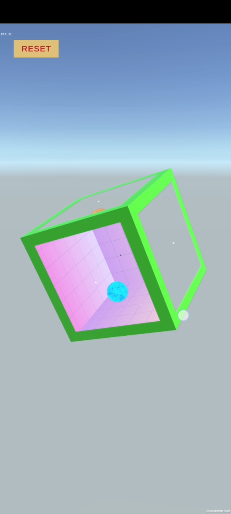
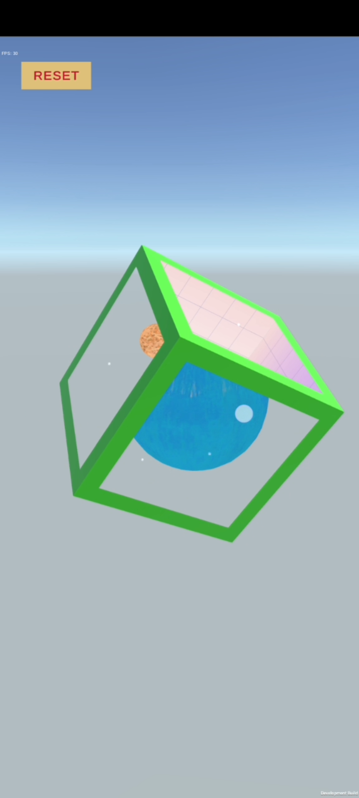

# Magic Cube

A Unity technical prototype exploring multiple independent worlds contained within the faces of a single cube.

## Play the Prototype

**[Download Android APK](../../releases/latest)**

> Android build — approximately 48 MB.

## Demo

**[Gameplay Video]((https://youtube.com/shorts/EJ05u_SSlzw))**

  
  

## Overview

The project explores whether a cube can act as a container for multiple visual worlds.

Each face represents a different world, with its contents visually constrained to that face while the cube can be rotated and interacted with.

The prototype was developed independently in approximately three weeks.

## Technical Implementation

### Stencil-Based Rendering

The primary technical challenge was restricting each world's contents to its corresponding cube face.

I implemented this using Unity's stencil buffer, with the cube faces acting as masks for their respective worlds.

This allows multiple visual environments to coexist within the same scene without physically enclosing each world.

### Physics Interaction

Physics-enabled objects were incorporated into the prototype to test how interactive elements behave within the individual worlds.

## My Contribution

I independently:

- Designed the core concept and prototype.
- Implemented the stencil-based rendering system.
- Created the visual elements and environments.
- Implemented physics-enabled interactions.
- Tested the concept as a potential game mechanic.

## Technologies

- **Engine:** Unity
- **Language:** C#
- **Rendering:** Stencil Buffer / Shaders
- **Physics:** Unity Physics
- **3D:** Blender

## Development

**Development time:** Approximately 3 weeks

The project was built primarily as a technical feasibility prototype rather than a complete game.

## What I Learned

This project gave me practical experience with Unity's rendering pipeline, particularly stencil-based masking and the relationship between rendering techniques and gameplay mechanics.

It also helped me explore how a rendering technique can support a game mechanic rather than functioning purely as a visual effect.

## Status

**Prototype / Technical Experiment**
